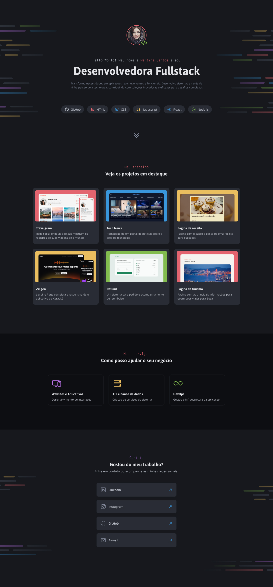

<h1 align="center"> Portfólio Dev </h1>

Projeto desenvolvido no curso Full Stack da Rocketseat como desafio prático.

  <a href="#-tecnologias">Tecnologias</a>&nbsp;&nbsp;&nbsp;|&nbsp;&nbsp;&nbsp;
  <a href="#-projeto">Projeto</a>&nbsp;&nbsp;&nbsp;|&nbsp;&nbsp;&nbsp;
  <a href="#-layout">Layout</a>&nbsp;&nbsp;&nbsp;|&nbsp;&nbsp;&nbsp;
  <a href="#memo-licença">Licença</a>

  

 

## 🚀 Tecnologias

Esse projeto foi desenvolvido com as seguintes tecnologias:

- HTML e CSS
- Git e Github
- Figma

## 💻 Projeto

O projeto Portfólio Dev é uma página de apresentação onde mostra o portfólio de um desenvolvedor e seus serviços prestados, este projeto foi desenvolvido como um desafio prático do curso Full Stack da Rocketseat, nele pude desenvolver a capacidade de utilizar de um layout e desenvolver a página do zero, montando uma estrutura para o CSS utilizando importação de arquivos, variáveis e classes utilitárias.

## 🔖 Layout

Você pode visualizar o layout do projeto através [DESSE LINK](<https://www.figma.com/design/zpbSgYbptIpwlloGmvSzvY/Portfolio-Dev-(Community)?node-id=2148-1651&t=t5gHkpIeJLQClKZA-1>). É necessário ter conta no [Figma](https://figma.com) para acessá-lo.

## :memo: Licença

Esse projeto está sob a licença MIT.

---